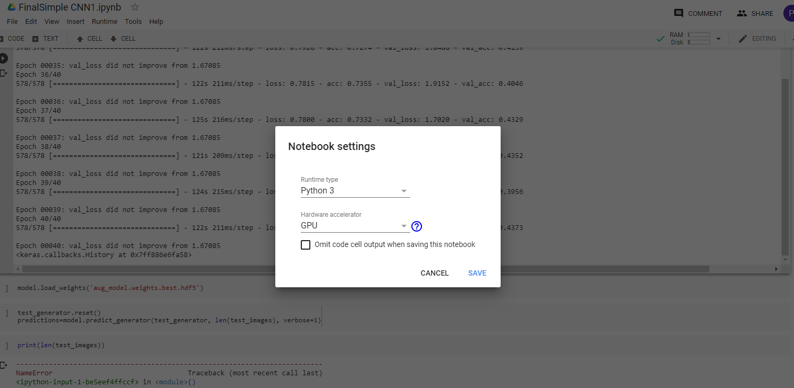
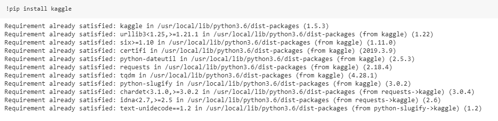
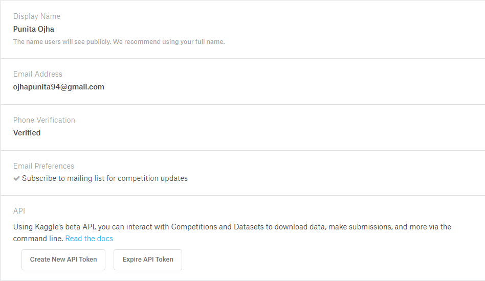
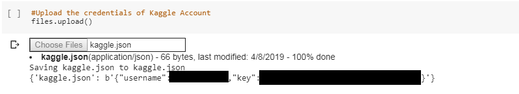
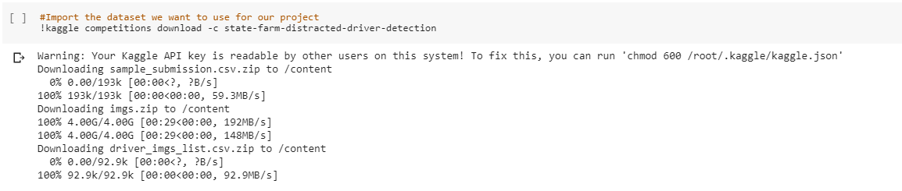
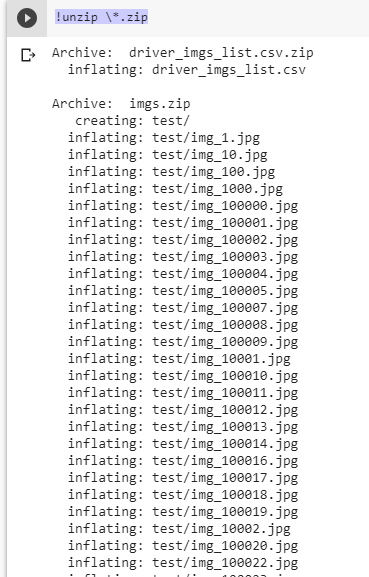

# **Machine Learning Engineer Nanodegree Capstone Proposal**

## **STATE FARM DISTRACTED DRIVER DETECTION**

##
###

##
##

### I) Use of Google Colab To Perform This Project

Google released its internal research tool colaboratory for public use. It has a Jupyter Notebook Environment and can be shared with anyone. More than one person can code on it at the same time. 
But even bigger attraction for Google Colab is its free computing power. 

It gives Tesla K80 GPU free for maximum 12 hours for a specific instance. For GPU environment, it gives 12 GB of RAM and 358 GB for disk space approximately.

**Instructions for enabling GPU Environment in Google Colab workspace.**

1. Open Google Colab Notebook by going on https://colab.research.google.com/.

2. Go to Runtime and Click on 'Change Runtime Type'.

3. A dialog box with name Notebook Settings will open as shown in the figure below. Change Hardware Accelerator Mode to GPU by selecting 'GPU' from the dropdown and then save it. 

### II) Obtaining dataset for visualization and analysation on your local machine. 

1. Visit https://www.kaggle.com . 

2. If you already have an account on Kaggle then sign in, else create an account on https://www.kaggle.com . 

3. Visit this url https://www.kaggle.com/c/state-farm-distracted-driver-detection/data and downloads the dataset for the project - **State Farm Distracted Driver Detection** from [here](https://www.kaggle.com/c/state-farm-distracted-driver-detection/data) by clicking on Download All Button . 

**Note:-** Please note that this step is optional as per users need.

### III) Obtaining dataset for use in Google Colab Workspace. 

1. Install kaggle client api in Google Colab Workspace. 

2. Download credentials of your kaggle account. To download credentials, login into kaggle account, click on my account, in this tab under Api Section, click on create new api token and the credentials for your account will automatically get downloaded from here.

3. Upload credentials in Google Colab Workspace by using following code cell in the jupyter notebook as shown in the image below. Please note that showing your kaggle.json file content publically is harmful for your account security and hence I have added black patch at the confidential information. Also I will delete the content of this specific cell before submission. When we run this cell, it prompts with a choose file button. Upload your kaggle.json file from your computer here which you downloaded in step 2. 

4. Then you can download the dataset for this competition from kaggle in google colab workspace using code as shown in the below image.  

5. Then we can extract this dataset in the colab workspace using code shown below.  

### IV) Performing experiment using following plugins and frameworks. 

We are performing this experiment in python 3 environment using following plugins and frameworks. 

1. Pandas
2. Numpy
3. Matplotlib
4. Keras

Note For Evaluator : 

Dearest evaluator, please note that the starting code of importing dataset and pre-processing them is same for all files of three models as we have worked on the Google Colab Workspace and the long time the model was taking to get trained it was not possible to accomplish the project in single instance so we model is practised and trained on different google colab instance and hence we re-written the code. However in future when we work on instance which provide long hours of support we will be moving the common code to the helper file or the utility file.  

